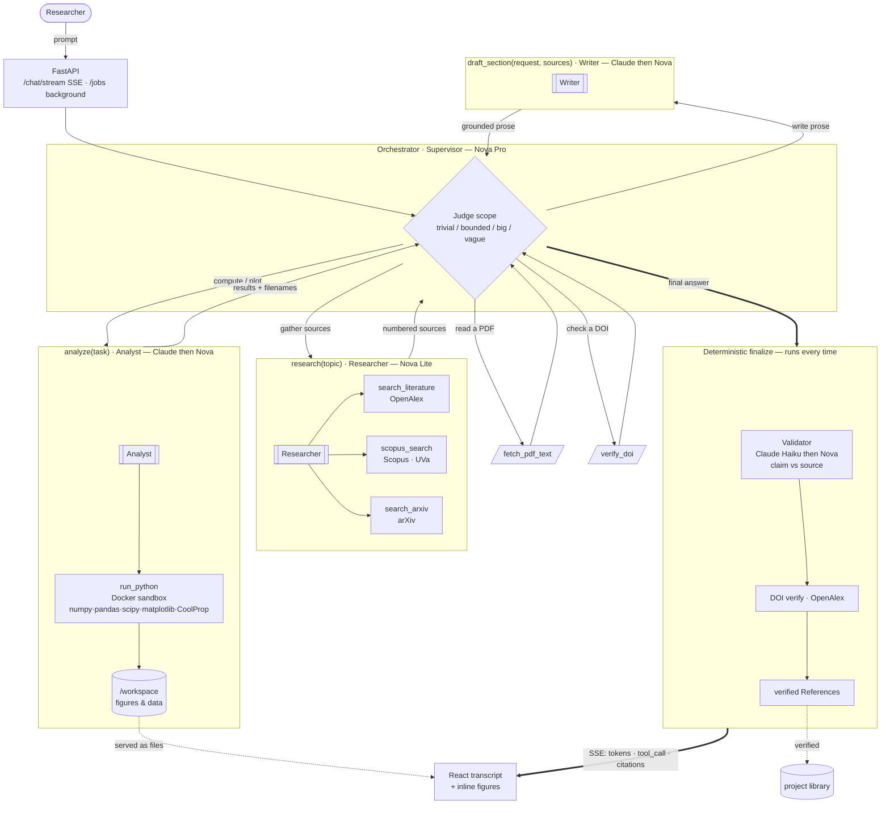

# Mentis

Single-user, multi-agent assistant for **researching and drafting scientific whitepapers** in
chemical/thermal engineering (absorption refrigeration, CO₂ / biobased solvents).

## Architecture (lean)

- **`backend/`** — [Strands Agents](https://strandsagents.com) (Bedrock) multi-agent supervisor behind a FastAPI **SSE** stream.
  - A Nova **supervisor** orchestrates three sub-agents (agents-as-tools): a **Researcher** (Nova Lite) gathers sources, an **Analyst** (Claude→Nova) computes/plots by running Python in a Docker sandbox, and a **Writer** (Claude→Nova) drafts journal-grade prose. After the run a **Validator** (Claude Haiku→Nova) checks every claim against its cited source.
  - Tools: `search_literature` (OpenAlex, free), `scopus_search` (UVa key), `search_arxiv`, `run_python` (sandbox), `fetch_pdf_text`, `verify_doi`.
  - Research is done **live per session** — no persistent vector store.
- **`frontend/`** — React + Vite + Tailwind, **Claude Code-style streaming transcript** (live tokens + collapsible tool-call cards).
- **Region:** `eu-south-2` (Spain). **Models:** Amazon Nova + Claude via EU inference profiles.
- **Storage:** conversations in a local JSON store (swap to DynamoDB on-demand at deploy).
- **Cost:** < €50/mo single user (~€2–12 in practice; almost all of it Bedrock tokens).
- **AgentCore-ready:** lifts into AgentCore Runtime later with a ~10-line wrapper change.

## Agent flow

The supervisor judges the **scope** of each turn, then loops over its tools — three sub-agents
(agents-as-tools) plus two direct tools — until it has an answer. Every run then ends with a
deterministic citation pass, so references are verified regardless of what the model did.



**Reading it:** solid arrows are a tool or sub-agent call; the supervisor *loops* over them
(it can call several, in any order, more than once) before emitting a final answer. `analyze`
and `draft_section` try **Claude first, then fall back to Nova** if Claude isn't enabled.
`research` only queries the sources enabled for that project. The bottom band (Validator → DOI
verify → References) is **not** the model's choice — it runs deterministically after every turn,
which is the credibility control.

## Run locally

```powershell
# Backend (needs AWS creds with Bedrock access in eu-south-2)
cd backend
py -3.12 -m venv ..\.venv                       # once
..\.venv\Scripts\python -m pip install -r requirements.txt
copy .env.example .env                           # set region / creds
..\.venv\Scripts\uvicorn app.server:app --port 8080

# Frontend (separate terminal)
cd frontend
npm install
npm run dev                                       # http://localhost:3000
```

## Research notes

`docs/research/` — scientific-paper conventions (Spain), model cost/options, and the AgentCore
architecture analysis that informed this design.
